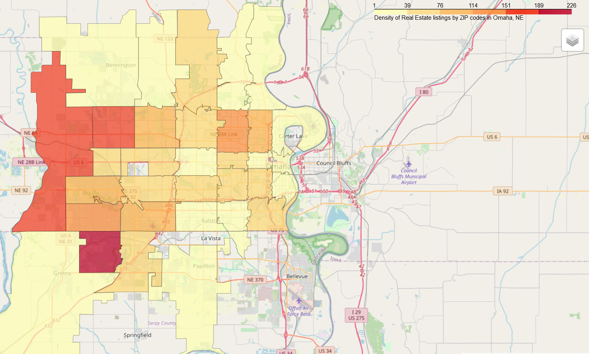
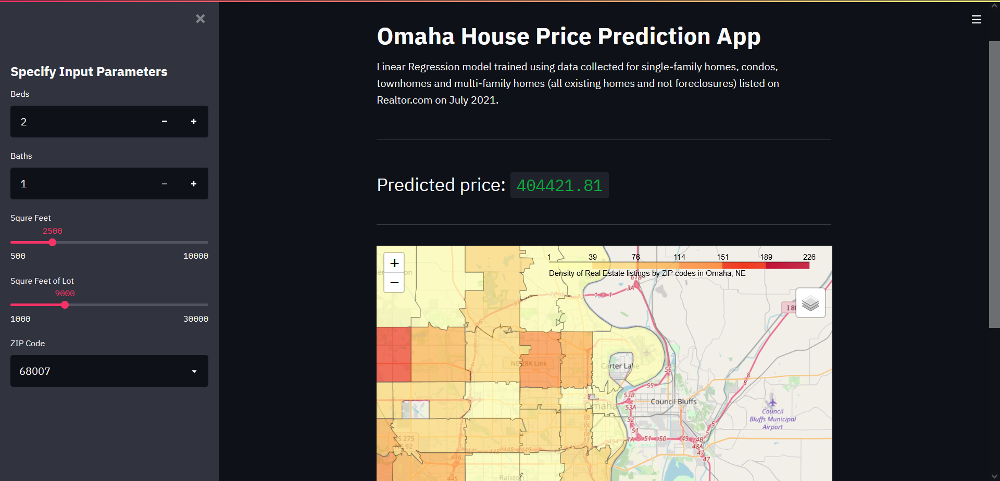

# Omaha House Price Prediction
Building a model to predict house prices in Omaha, NE using data scraped from [Realtor.com](https://www.realtor.com/).

## Data 
Data collected using realtor-scraper python script in the scraper folder; for single-family homes, condos, townhomes and multi-family homes (all existing homes and not foreclosures) listed on Realtor.com on July 2021.

## Packages used
- Beautiful Soup is a python package for parsing HTML and XML documents.
```
conda install -c anaconda beautifulsoup4 
```
- Folium is a python library used for visualizing geospatial data.
```
conda install -c conda-forge folium
```
- Streamlit is a python library for custom web apps for machine learning and data science.
```
conda install -c conda-forge streamlit 
```

## Process
1. Data Cleaning
2. EDA
3. Outlier Detection
4. Model Selection



